# 2022년 2학기 모바일 앱 프로젝트 

### 👉🏻 Cordova로 하이브리드 앱 만들기 설정

1. JDK 설치 - 1.8 버전 (맥은 기본 버전이 1.8)
 	

2. 아파치 앤트 설치하기 - 맥은 터미널의 Homebrew로 설치
 

3. 안드로이드 SDK 설치하기 - 맥은 안드로이드 스튜디오의 설정 탭에서 설치
 

4. 안드로이드 플랫폼 패키지 추가 설치하기 - 안.스 설정 탭에서 설치
* Tools
	Android SDK Tools
	Android SDK Platfor-tools
	Android SDK Build-tools
     
* Android R(Api 29, R preview)
	SDK Platform Android R Preview
	Google Play Intel x86 Atom_64_System Image
	Google APIs intel x86 Atom_64_System Image
     
* Extra
	Android Support Repository
	Google Repository
	Google USB Driver
	Intel x86 Emulator Accelerator(HAXM installer)
     

5. 환경 변수 설정하기 - 터미널로 vi ~/.zshrc 열어서 해당 패스 추가
* export JAVA_HOME=/Library/Java/JavaVirtualMachines/jdk1.8.0_321.jdk/Contents/Home 
* export PATH=&#36;JAVA_HOME/bin:&#36;PATH
* export ANDROID_HOME=&#36;HOME/Library/Android/sdk
* export PATH=&#36;PATH:&#36;ANDROID_SDK_ROOT/emulator
* export PATH=&#36;PATH:&#36;ANDROID_SDK_ROOT/tools
* export PATH=&#36;PATH:&#36;ANDROID_SDK_ROOT/tools/bin
* export PATH=&#36;PATH:&#36;ANDROID_SDK_ROOT/platform-tools

 

6. Node.js 설치하기 - 터미널 Homebrew 이용하여 최신 버전 설치
 

7. 폰갭(코르도바 설치하기)
>npm install -g phonegap
>npm install -g cordova
>cordova -v
>npm update -g phonegap
>npm update -g cordova

 

8. 안드로이드 스튜디오 설치

  

9. 안드로이드 코르도바 앱 만들기
>mkdir HybridProject
>cd HybridProject
>cordova create test com.example.test testApp -d
>cd test
>cordova paltform add android

* AVD  실행 혹은 스마트폰 컴과 연결
>cordova run android --list
>cordova run android

10. css, js 파일 CDN -> 다운로드 방식으로 수정

11.  코드 추가 

 

## 👉🏻 0920 - [자기소개 페이지](https://github.com/SuimKim/SuimKim.github.io) 작성

#### 🍑 파란색 링크를 클릭하면 상세 레파지토리로 이동해요. 🍑
 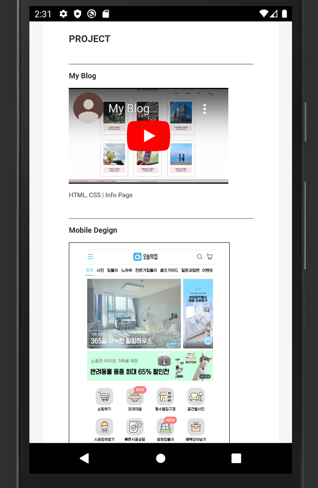 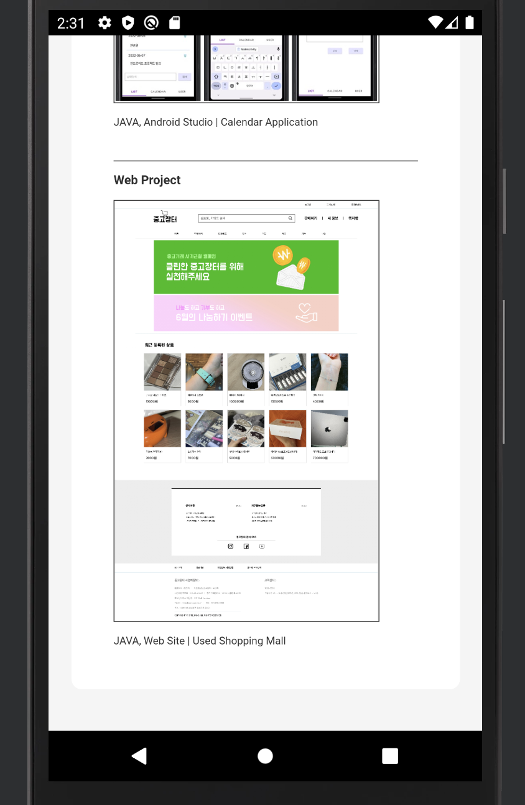

 

## 👉🏻 0927 - [회사소개 페이지](https://github.com/SuimKim/Netlify) 작성

#### 🍑 파란색 링크를 클릭하면 상세 레파지토리로 이동해요. 🍑
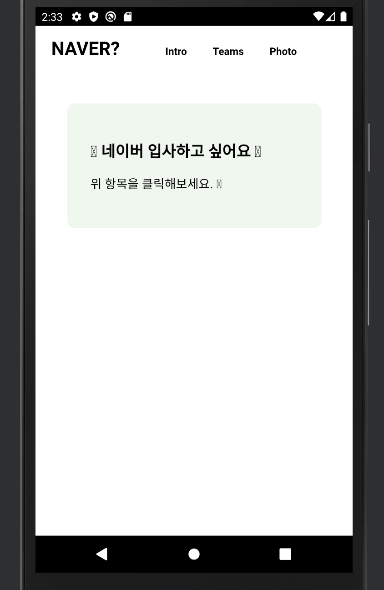 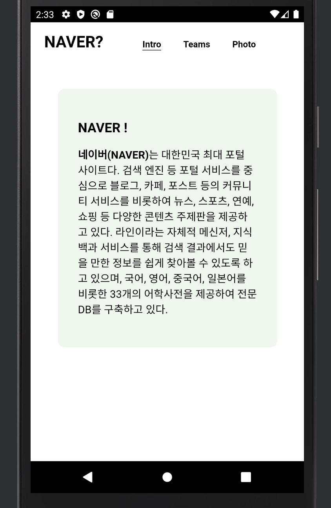  
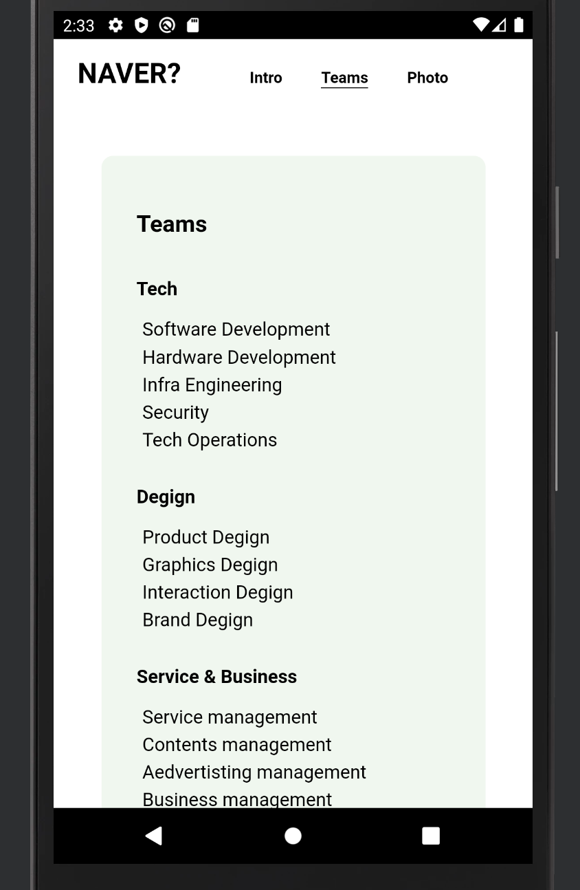 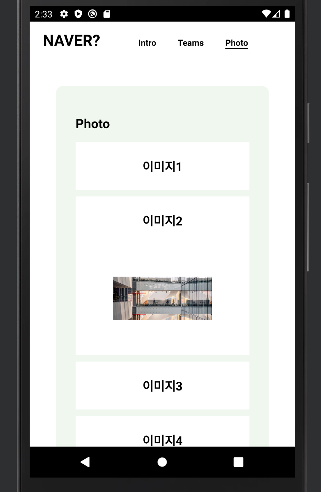 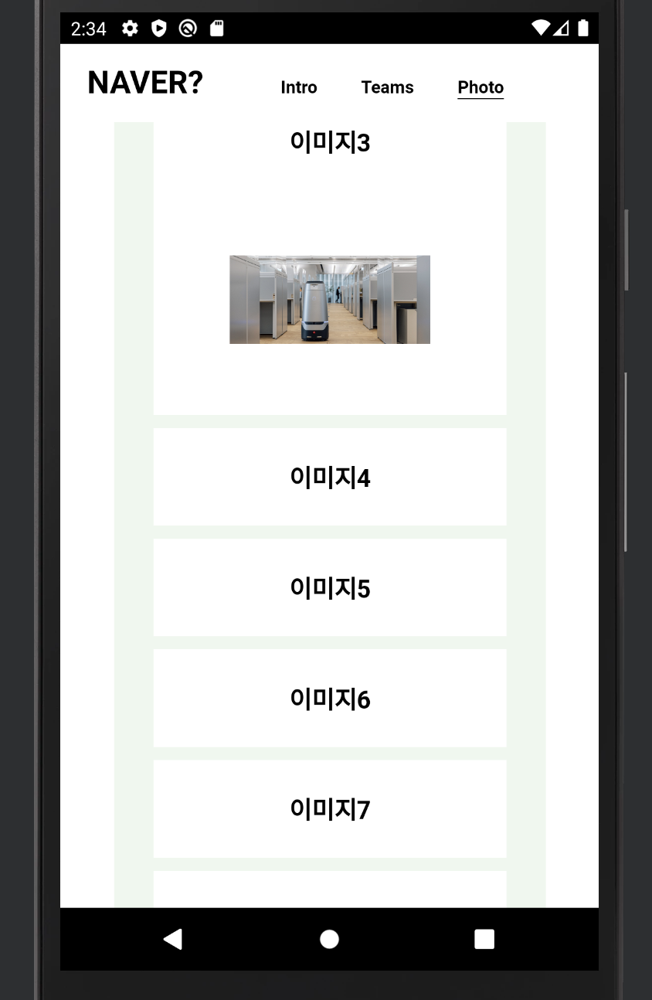

 

## 👉🏻 1011 - [모바일 포트폴리오](https://github.com/SuimKim/Mobile-Portpolio) 제작

#### 🍑 파란색 링크를 클릭하면 상세 레파지토리로 이동해요. 🍑
 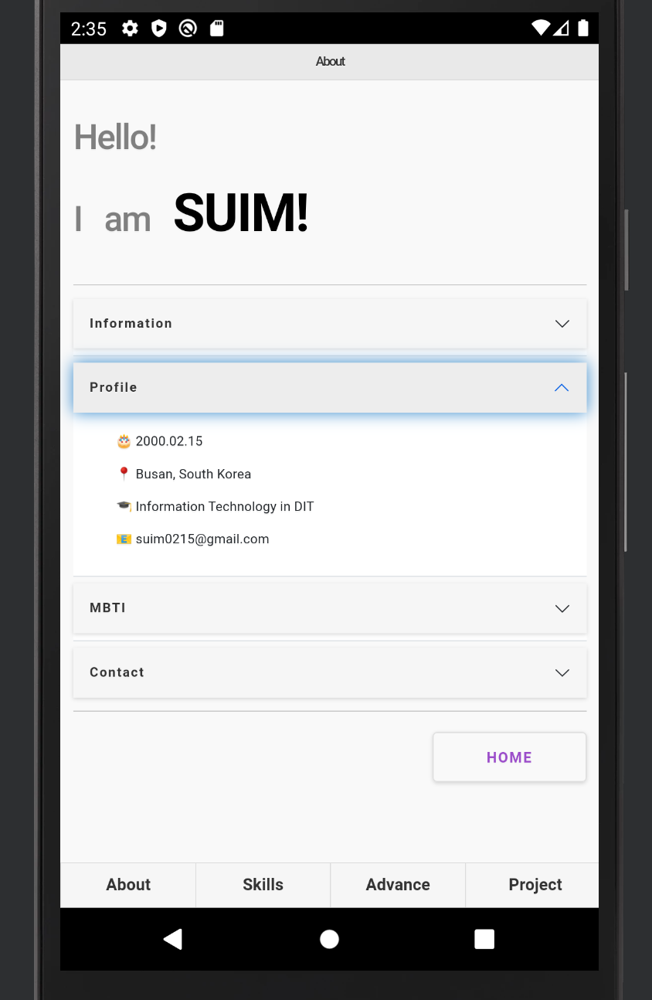 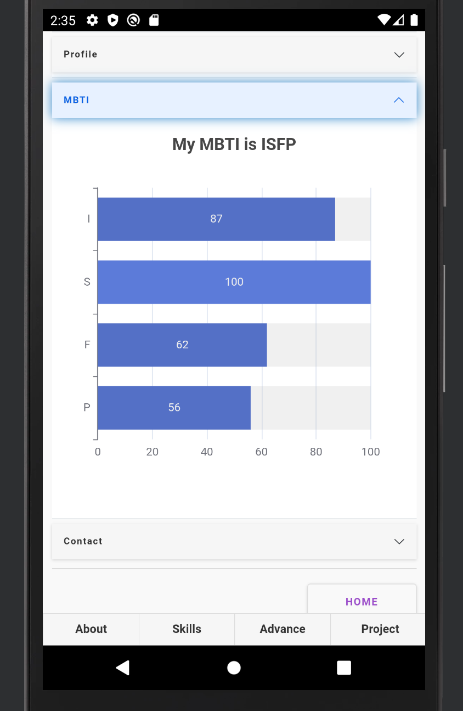    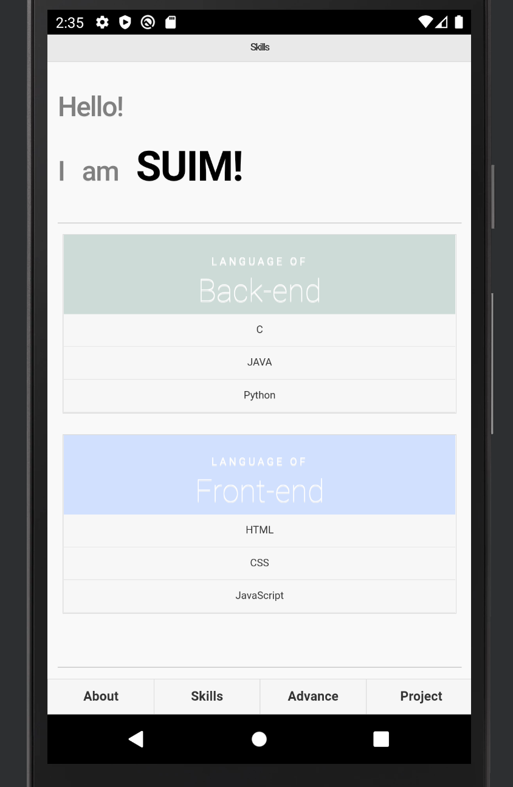 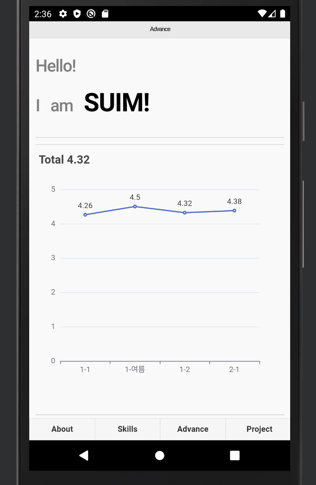 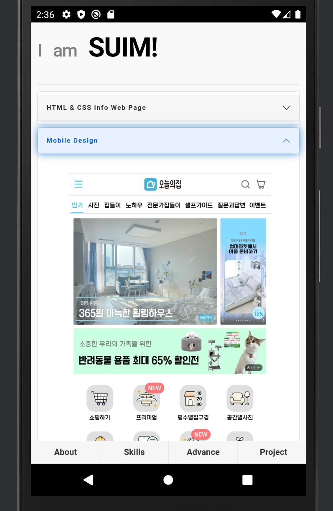

 

